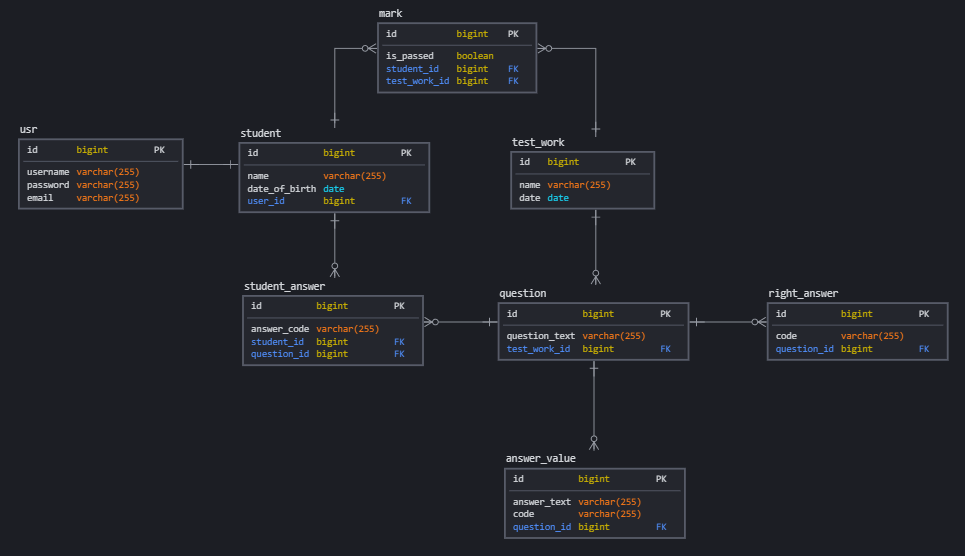

### Сборка и запуск

##### Сборка и запуск с использованием Docker

```
git clone https://github.com/ignal1/tester.git
cd tester
docker-compose up
```
##### Сборка и запуск без использования Docker
Перед запуском приложения необходимо создать базу данных **Postgres** с именем **tester**, пользователем **postgres** и паролем **postgres**.

```
git clone https://github.com/ignal1/tester.git
cd tester
./mvnw spring-boot:run
``` 

После запуска приложения в базе данных автоматически создаются таблицы и некоторые таблицы заполняются данными. Реализовано с помощью **Liquibase**.

Приложение использует порт **8099**.

### Загрузка правильных ответов
Загрузка правильных ответов выполняется по расписанию, каждый день в 18:00 (реализовано в методе `scheduledTasks()` класса `ScheduleService`). Путь к CSV файлу и время загрузки указаны в конфигурационном файле `application.yml`. В данном случае файл должен находиться в директории проекта. При условии успешной загрузки (файл присутствует и в нем корректные данные) старые данные удаляются из таблицы `right_answer`. При неудачной загрузке старые данные остаются в данной таблице (реализовано с помощью `@Transactional`).

Файл CSV не должен содержать заголовков. Пример файла с правильными ответами находится в корне проекта (файл `right_answers.csv`). 

### Оценка пройденных тестов
После загрузки правильных ответов (которая происходит ежедневно в 18:00) выполняется проверка ответов студентов, хранящихся в базе данных на текущий момент (метод `score()` класса `ScoreService` вызывается в методе `scheduledTasks()` класса `ScheduleService`). В результате работы метода `score()` в таблицу `mark` заносятся данные о результатах тестирования студентов. 

### TODO
Все что успел сделать на текущий момент (06.08.2021 17:00). Постараюсь дополнить отдельными комитами в ближайшие дни. Также не было времени как следует потестировать систему.

* API (endpoints)
* frontend
* security
* ~~логирование~~

### UPD 09.08.2021
* Добавлено логирование. В частности, логируется метод `parseRightAnswers()` класса `TesterService`, в результате чего в логах отображается время начала и конца загрузки CSV файла с правильными ответами, а также количество обработанных строк. Сообщения выводятся на консоль и в файл `/logs/tester.log`.

* Добавлено несколько контроллеров для получения данных с сервера.

* Начато создание front-end.

* Исправлены некоторые ошибки в коде. Добавлена схема БД.
### Схема базы данных

